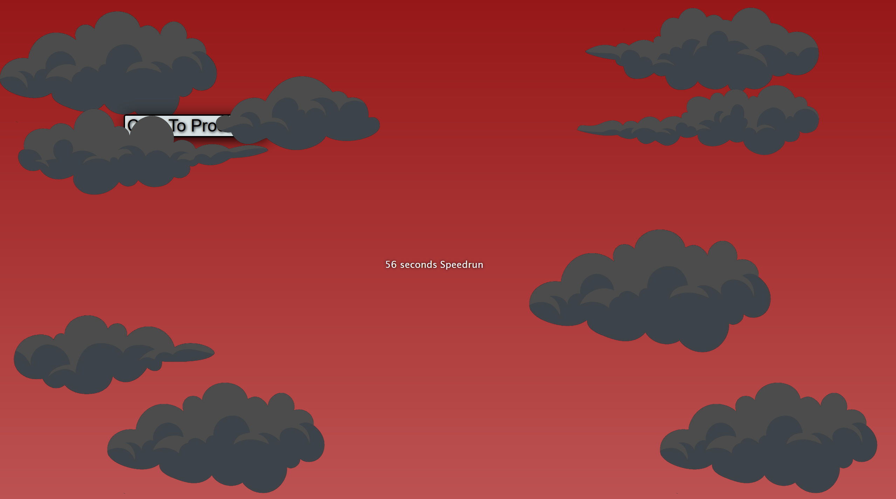

# ENSIA Space [ Meme Webstie Project ]

**A Fun and Playful Exploration of Web Development**

## Introduction
Welcome to **ENSIA Space**, a project created in just 5 days during the winter break, with no prior knowledge of CSS, HTML, or JavaScript. This was an optional homework assignment for university, designed primarily for fun and creativity. Please note that this project is filled with numerous memes and cultural references, and it is not intended to be taken seriously.

The design for this project was based on a basic template provided by the instructor, which was kept simple for easy implementation. As such, the project closely followed the given template as a priority.

## Important Note
Please ensure that the browser you are using **does not block scripts' audio by default**, as settings may vary between browsers for security and user experience reasons.

## About the Project
ENSIA Space is a lighthearted, experimental website where you'll find a mix of humor and playful content. The project serves as an entertaining exploration of web development, featuring a variety of random memes—both old and new—to bring a smile to your face.

This website is not a polished or professional piece of work but rather a fun experiment to learn the basics of web development while adding a touch of humor along the way.

## Features
- **Memes Galore**: Enjoy a wide range of memes scattered throughout the site.
- **Cultural References**: The site is packed with references that reflect the quirks of our generation.
- **Surprises at Every Click**: You never know what you'll find when you explore the site, so click around and discover the unexpected.

## Important Notes
This project is intentionally playful and whimsical. Any bugs or unexpected behaviors you encounter are likely intentional and part of the fun. Please approach this site with a sense of humor and an open mind.

**Update:** The targeted audience (our teacher) loved it, and we received the Best Website Award for first-year students!

## Quick Run-Through

1. **Open the Folder in VS Code**: Ensure you open the entire folder in VS Code and that it is not in Safe Mode. Trust the folder to allow images and other assets to load properly.
2. **Launch the Website**: Open the `Index.html` file from the "Epic Website" folder using the Live Server extension.
3. **Explore Freely**: Click on anything and everything. Expect a variety of random memes to pop up—there's something for everyone!
4. **About Us Page Surprise**: For an extra touch of fun, wait at least 20 seconds on the About Us page (optional).
5. **Access Metadata/Assets**: Metadata, icons, favicon, and other assets can be found in the Images, Videos, and Music folders.
6. **Intentional Bugs**: Any bugs you encounter are likely intentional, adding to the playful nature of the project.

---

**Good luck on your finals!** Enjoy the journey through ENSIA Space!

## Screenshots: [Spoilers]

### Index Menu

*Index Menu (Impossible to click the button to proceed—maybe use something other than your mouse?)*

*The longer you stay, the climate changes, uncovering the speedrun counter, which, when clicked, will play something appropriate.*

### Landing Page

*Strictly follows the given template, with uniqueness coming in the form of design, the logo, and some hidden features.*

*Sidebar for the list of required websites, as requested by the instructor.*

### Our Services

*The services page [Reflective of our situation]*

### Some Online Tools

*Some online utilities, with nice and smooth animations.*

### GenZ Mode Easter Egg

*Easter egg: GenZ Mode, made for people with low attention spans (Everything is still functional).*

### Feedback Section

*Forum to submit feedback (No bugs exist; it's just your imagination).*

### About Us Section

The About section is still left to be uncovered by You!
